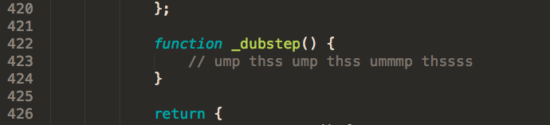
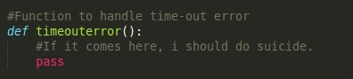
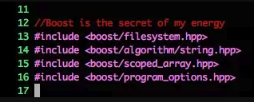

# devcomment | `Entertaining developers since 1950s`
A Collection of comments added by Developers worth to be noticed.

Submit a PR for any witty comment you came across.

---
```
// When I wrote this, only God and I understood what I was doing
// Now, God only knows
```

```
#define TRUE FALSE
// Happy debugging suckers
```

```
// TODO: Delete
```

```
/* Ah ah ah! You'll never understand why this one works. */
```

```
stop(); // Hammertime!
```

```
// TODO make this work
```

```
using namespace std;            // So sue me
```

```
// This is crap code but it's 3 a.m. and I need to get this working.
```

```
/* Please work */
Catch (Exception e) {  
//who cares? 
}
```

```
// This is black magic
// from
// *Some stackoverlow link
// Don't play with magic, it can BITE.
```

---








